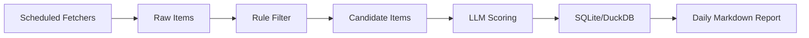

# 一人公司蓝海需求引擎优化版

## 优化原则

原方案的问题不是方向错，而是第一版过重。对一人公司来说，需求引擎的价值不在于爬虫、向量库或复杂模型本身，而在于每天稳定产出少量高质量、可验证、可立刻行动的 MVP 机会。

优化后的系统采用三条原则：

1. 先验证信号质量，再扩大数据规模。
2. 先用现成公开入口，再写复杂爬虫。
3. 先人工校准评分标准，再引入自动化模型决策。

## V0 目标

V0 不追求“全网海量监控”，只追求在 7 天内跑出第一批真实机会。

成功标准：

- 每天自动收集 50-300 条候选文本。
- 每天筛出 5-20 条高价值痛点。
- 每周产出 3-5 个可评估 MVP 创意。
- 每个创意都有来源链接、痛点摘要、目标用户、评分和下一步验证动作。

## V0 数据源

优先选择低维护、低封禁、能直接拿到文本的数据源。

| 优先级 | 来源 | 获取方式 | 用途 | 是否进入 V0 |
| --- | --- | --- | --- | --- |
| P0 | Reddit 细分板块 | Reddit API 或 RSS | 获取真实抱怨、替代品需求、SaaS 购买信号 | 是 |
| P0 | Hacker News | Algolia HN API | 获取开发者工具、B2B、开源工具痛点 | 是 |
| P0 | App Store 评论 | iTunes RSS JSON Feed | 获取竞品差评和功能缺口 | 是 |
| P1 | V2EX | RSSHub | 获取中文开发者和工具类需求 | 第二阶段 |
| P1 | Google Play | Apify 免费额度 | 获取移动端竞品评论 | 第二阶段 |
| P2 | X/Twitter | 低价 API 或抓取服务 | 高价值但维护成本较高 | 暂缓 |
| P2 | 动态网页 | Crawlee/Playwright | 只针对确定有价值的网站 | 暂缓 |

V0 建议只接入 3 个源：Reddit、HN、App Store。这样既能覆盖社区讨论、开发者场景和竞品评论，又不会在第一周陷入反爬工程。

## V0 架构



### 组件边界

**Scheduled Fetchers**

负责从 Reddit、HN、App Store 拉取文本和元信息。第一版使用本地脚本或 GitHub Actions 定时运行，不引入 Airflow、队列系统或分布式任务。

**Rule Filter**

只做便宜的粗筛，不做复杂 NLP：

- 包含强痛点词：`alternative to`、`I wish`、`too expensive`、`doesn't support`、`manual`、`slow`、`broken`、`missing`、`frustrating`
- 排除低价值短文本：少于 30 个字符、只有情绪词、无产品/任务对象
- 去重：按 URL、标题、正文 hash 去重

**LLM Scoring**

V0 可以直接用一个云端模型或本地模型评分。不要一开始上 embedding 聚类。每天候选量低于 100 条时，普通 JSON 打分足够。

**Storage**

用 SQLite 或 DuckDB。V0 不需要 Postgres、Qdrant、ChromaDB。

**Report**

先生成 Markdown 日报，比做前端更快。看板放到 V1。

## 数据模型

### raw_items

| 字段 | 类型 | 说明 |
| --- | --- | --- |
| id | text | 内容 hash |
| source | text | reddit, hn, app_store |
| source_url | text | 原文链接 |
| title | text | 标题 |
| body | text | 正文 |
| author | text | 作者，可为空 |
| published_at | datetime | 发布时间 |
| fetched_at | datetime | 抓取时间 |
| metadata_json | text | 平台特定字段 |

### candidates

| 字段 | 类型 | 说明 |
| --- | --- | --- |
| id | text | 候选 id |
| raw_item_id | text | 来源 raw item |
| normalized_text | text | 清洗后的文本 |
| matched_rules | text | 命中的规则 |
| language | text | 语言 |
| created_at | datetime | 入选时间 |

### scored_ideas

| 字段 | 类型 | 说明 |
| --- | --- | --- |
| id | text | 评分 id |
| candidate_id | text | 候选项 |
| mvp_concept | text | 一句话产品想法 |
| target_audience | text | 目标用户 |
| pain_summary | text | 痛点摘要 |
| errc_score | integer | 0-25 |
| jtbd_score | integer | 0-25 |
| opc_score | integer | 0-30 |
| rice_score | integer | 0-20 |
| total_score | integer | 0-100 |
| verdict | text | Build Now, Monitor, Discard |
| validation_step | text | 下一步验证动作 |
| scored_at | datetime | 评分时间 |

## V0 评分 Prompt

```text
You are a pragmatic indie hacker strategist.

Evaluate the following user complaint or feature request as a potential micro-SaaS or software MVP opportunity.

Score it using this 100-point framework:

1. ERRC / Blue Ocean Potential, 0-25:
Can a small software product eliminate manual work, reduce friction, raise value in an underserved niche, or create a new workflow?

2. JTBD Urgency, 0-25:
Is this a frequent and painful job-to-be-done? Is the user expressing real struggle, time loss, money loss, or workflow blockage?

3. One-Person Company Fit, 0-30:
Can one developer build a useful MVP in 1-2 weeks? Is there clear willingness to pay, especially B2B or prosumer?

4. Reach and Distribution, 0-20:
Is this likely shared by many similar users? Does it have SEO, community, marketplace, or direct outreach distribution potential?

Return strict JSON only:

{
  "mvp_concept": "one sentence",
  "target_audience": "specific niche",
  "pain_summary": "short summary",
  "scores": {
    "errc": 0,
    "jtbd": 0,
    "opc": 0,
    "rice": 0,
    "total": 0
  },
  "verdict": "Build Now | Monitor | Discard",
  "why": "short reasoning",
  "validation_step": "one concrete next action to validate demand"
}

Input:
{{candidate_text}}
```

## 分阶段路线

### Phase 0：7 天验证版

目标：证明这个系统真的能发现有商业价值的痛点。

任务：

- 写 3 个 fetcher：Reddit、HN、App Store。
- 写规则过滤器和去重逻辑。
- 建 SQLite/DuckDB 表。
- 对候选文本调用评分 Prompt。
- 每日生成 `reports/YYYY-MM-DD.md`。

不做：

- 不做 Playwright 爬虫。
- 不做住宅代理。
- 不做向量库。
- 不做复杂前端。
- 不做多模型投票。

### Phase 1：半自动研究台

触发条件：V0 每周稳定产出至少 3 个值得人工跟进的创意。

新增：

- 简单 Next.js 或 Streamlit 看板。
- 候选项人工标注：`good_signal`, `bad_signal`, `duplicate`, `too_hard`, `too_broad`。
- 将人工标注样本加入 few-shot prompt。
- 增加 V2EX 和 Google Play。

### Phase 2：聚类与趋势发现

触发条件：候选数据累计超过 2000 条，人工阅读开始吃力。

新增：

- Embedding 生成。
- 相似痛点聚类。
- 30 天信号密度曲线。
- 同类竞品和关键词聚合。

### Phase 3：自动化机会雷达

触发条件：系统评分和人工判断一致率超过 70%。

新增：

- 每周自动输出 Top 10 机会。
- 自动生成验证落地页文案。
- 自动生成 Reddit/HN/邮件触达草稿。
- 对高分机会生成 MVP 技术方案。

## 关键取舍

| 原方案 | 优化方案 | 原因 |
| --- | --- | --- |
| 先建完整爬虫系统 | 先用 API/RSS | 降低维护成本 |
| 一开始上本地模型和向量库 | 先用规则 + 单次评分 | 数据少时复杂模型收益低 |
| 6 周搭完整系统 | 7 天出第一版日报 | 更快验证是否值得继续 |
| 全网海量采集 | 少量高信号源 | 一人公司需要决策，不需要大数据幻觉 |
| 先做看板 | 先做 Markdown 报告 | 避免 UI 抢走核心验证时间 |

## 第一周执行清单

Day 1:

- 建项目骨架。
- 建数据库 schema。
- 实现 HN fetcher。

Day 2:

- 实现 Reddit fetcher。
- 加去重和基础规则过滤。

Day 3:

- 实现 App Store fetcher。
- 统一三类来源输出格式。

Day 4:

- 接入 LLM JSON 评分。
- 保存 `scored_ideas`。

Day 5:

- 生成 Markdown 日报。
- 按总分排序，突出 80 分以上机会。

Day 6:

- 人工 review 过去 5 天结果。
- 调整规则词、评分权重和 prompt。

Day 7:

- 决策是否进入 Phase 1。
- 若一周内没有 3 个值得跟进的机会，先换数据源，不升级架构。

## 推荐项目结构

```text
blue-ocean-engine/
  README.md
  data/
    demand_engine.db
  reports/
  src/
    fetchers/
      hn.ts
      reddit.ts
      app_store.ts
    filters/
      rules.ts
      dedupe.ts
    scoring/
      prompt.ts
      score.ts
    storage/
      schema.sql
      db.ts
    reports/
      daily.ts
  .github/
    workflows/
      daily.yml
```

## V0 实现规格

### CLI 入口

V0 只需要 4 个命令，避免把早期系统拆成过多微小脚本。

```text
pnpm run fetch -- --source hn
pnpm run fetch -- --source reddit
pnpm run fetch -- --source app_store
pnpm run daily
```

命令职责：

| 命令 | 输入 | 输出 | 说明 |
| --- | --- | --- | --- |
| `pnpm run fetch -- --source hn` | HN 查询关键词、时间窗口 | `raw_items` | 拉取 HN stories/comments |
| `pnpm run fetch -- --source reddit` | subreddit 列表、时间窗口 | `raw_items` | 拉取帖子和高价值评论 |
| `pnpm run fetch -- --source app_store` | App ID 列表、国家/地区 | `raw_items` | 拉取竞品最新评论 |
| `pnpm run daily` | 当日所有 raw items | `reports/YYYY-MM-DD.md` | 过滤、评分、入库、生成日报 |

第一版不需要复杂任务编排。`pnpm run daily` 可以顺序执行：fetch -> filter -> score -> report。只要每一步有清晰日志和失败退出码，后续迁移到 GitHub Actions 或 cron 都很容易。

### 配置文件

使用一个简单的 `config/sources.json` 管理数据源，避免把关键词、subreddit、App ID 写死在代码里。

```json
{
  "hn": {
    "queries": ["alternative to", "too expensive", "I wish", "manual workflow"],
    "lookback_hours": 24,
    "max_items": 100
  },
  "reddit": {
    "subreddits": ["SaaS", "Entrepreneur", "smallbusiness", "freelance", "webdev"],
    "lookback_hours": 24,
    "max_items_per_subreddit": 50
  },
  "app_store": {
    "apps": [
      { "name": "example_competitor", "id": "123456789", "country": "us" }
    ],
    "max_reviews_per_app": 50
  }
}
```

环境变量只放密钥和模型配置：

```text
OPENAI_API_KEY=
SCORING_MODEL=
DATABASE_URL=
```

如果没有配置 `DATABASE_URL`，默认使用 `data/demand_engine.db`。

### Fetcher 输出契约

三个 fetcher 必须返回同一种内部结构。这样过滤、去重、评分和报告层不需要理解平台差异。

```ts
type RawItemInput = {
  source: "hn" | "reddit" | "app_store";
  source_url: string;
  title: string;
  body: string;
  author?: string;
  published_at?: string;
  metadata: Record<string, unknown>;
};
```

规范：

- `source_url` 必须稳定，优先使用原平台永久链接。
- `title` 可以为空字符串，但不能缺字段。
- `body` 是主要分析文本。评论源要把评论正文放入 `body`。
- `metadata` 保留平台字段，例如 upvotes、comment_count、rating、app_name。
- 入库前用 `source + source_url + title + body` 生成稳定 hash 作为 `raw_items.id`。

### 规则过滤规格

规则过滤器输出 `CandidateInput`：

```ts
type CandidateInput = {
  raw_item_id: string;
  normalized_text: string;
  matched_rules: string[];
  language: "en" | "zh" | "unknown";
};
```

V0 规则分三类：

| 类别 | 示例 | 处理 |
| --- | --- | --- |
| 强痛点词 | `too expensive`, `manual`, `slow`, `broken`, `missing` | 任一命中即可入选 |
| 替代品信号 | `alternative to`, `switching from`, `looking for a tool` | 提高优先级 |
| 购买/预算信号 | `pay for`, `budget`, `subscription`, `client work` | 提高评分优先级 |

排除规则：

- `normalized_text` 少于 30 个字符。
- 只表达情绪，没有任务、产品、流程或对象。
- 已存在相同 `raw_item_id`。
- 与最近 30 天候选项正文 hash 完全相同。

V0 不做语义去重。只有当日报中重复明显影响阅读时，再引入 embedding。

### LLM 评分校验

评分层必须把模型输出当作不可信输入处理：

1. 要求模型返回 strict JSON。
2. 用 schema 校验字段是否完整。
3. 校验四个分数范围：ERRC 0-25、JTBD 0-25、OPC 0-30、RICE 0-20。
4. 重新计算 `total_score`，不要直接相信模型给出的 total。
5. JSON 解析失败时重试 1 次。
6. 第二次仍失败时，把候选项标记为 `score_failed`，保留原始错误，不阻塞整份日报。

建议 verdict 规则：

| 条件 | verdict |
| --- | --- |
| `total_score >= 80` 且 `opc_score >= 22` | Build Now |
| `total_score >= 60` | Monitor |
| 其他 | Discard |

模型的 `verdict` 可以作为参考，但最终 verdict 应由本地规则统一生成。

### 日报模板

日报要服务决策，而不是堆数据。推荐结构：

```markdown
# Blue Ocean Demand Report - YYYY-MM-DD

## Executive Summary

- Raw items collected:
- Candidates after filtering:
- Ideas scored:
- Build Now:
- Monitor:

## Top Opportunities

### 1. <MVP Concept>

- Score:
- Verdict:
- Source:
- Target audience:
- Pain:
- Why now:
- Validation step:

## Monitor List

| Score | Concept | Source | Validation |
| --- | --- | --- | --- |

## Discarded Patterns

- Low willingness to pay:
- Too broad:
- Too hard for one person:

## Rule Notes

- New useful phrases:
- False positives:
- Source quality notes:
```

每个 Top Opportunity 必须带原始来源链接。没有来源链接的想法不进入日报顶部。

### GitHub Actions 运行方式

V0 可以每天自动跑一次，也允许手动触发。

```yaml
name: Daily Demand Report

on:
  schedule:
    - cron: "0 1 * * *"
  workflow_dispatch:

jobs:
  daily:
    runs-on: ubuntu-latest
    steps:
      - uses: actions/checkout@v4
      - uses: actions/setup-node@v4
        with:
          node-version: 20
      - run: pnpm install --frozen-lockfile
      - run: pnpm run daily
        env:
          OPENAI_API_KEY: ${{ secrets.OPENAI_API_KEY }}
          SCORING_MODEL: ${{ vars.SCORING_MODEL }}
      - uses: actions/upload-artifact@v4
        with:
          name: daily-report
          path: reports/
```

如果希望日报自动提交回仓库，可以在 V0 稳定后再增加 commit 步骤。第一周先 artifact 下载即可，减少权限和 Git 冲突问题。

## V0 验收标准

第一版完成不以“功能多”为标准，而以能否稳定跑通闭环为标准。

必须满足：

- `pnpm run daily` 在本地可以从零生成数据库和当日日报。
- 单个数据源失败不会导致其他数据源结果丢失。
- 每条 Top Opportunity 都有来源链接、痛点摘要、目标用户、分数、verdict 和验证动作。
- LLM 输出异常会被记录，不会让整次运行崩溃。
- 同一条来源重复运行不会重复入库。
- 日报中 `Build Now` 和 `Monitor` 分开展示。

建议测试：

- 用 fixture 测试 HN、Reddit、App Store 三种 RawItem 标准化。
- 用固定样本文本测试规则过滤命中和排除。
- 用模拟 LLM JSON 测试评分解析、分数范围和 total 重算。
- 用临时 SQLite 数据库测试重复运行的幂等性。
- 用 5-10 条 fixture 生成一份快照日报，确认 Markdown 结构稳定。

## 第一批监控主题

为了提高第一周命中率，V0 不应泛泛抓取所有创业社区，而应先围绕可被一人公司快速交付的软件机会。

推荐主题：

| 主题 | 典型用户 | 可能机会 |
| --- | --- | --- |
| 手工报表和表格搬运 | 运营、财务、独立顾问 | CSV 清洗、自动报告、表格转工作流 |
| 小团队客户沟通 | agency、freelancer、B2B 服务商 | 客户门户、审批、状态同步 |
| 开发者内部工具 | indie hacker、SaaS founder、工程团队 | 日志分析、部署辅助、文档同步 |
| 垂直软件差评 | 使用 App Store/Google Play SaaS 的专业用户 | 更轻、更便宜、更专注的替代品 |
| 合规和格式转换 | 跨境卖家、教育、医疗、法律助理 | 模板生成、文件检查、流程提醒 |

第一周宁可选 5 个窄主题跑深一点，也不要抓 50 个宽泛主题。

## 人工复盘表

每天看完日报后，人工追加一小段复盘，比立刻训练模型更有效。

```markdown
## Human Review

- Best signal today:
- Worst false positive:
- New phrase to add:
- Phrase to downrank:
- Source to increase:
- Source to decrease:
- One MVP worth validating tomorrow:
```

这些复盘内容是 Phase 1 few-shot prompt 和规则优化的原料。

## 最小可用结论

最优路线不是直接建一个“全自动蓝海引擎”，而是先建一个“每天帮你发现 5 条真实痛点的窄口漏斗”。只要这个漏斗能连续两周产出可验证的 MVP 机会，再逐步加看板、向量聚类、本地模型和更复杂的数据源。

这套优化后的方案把风险从“我花 6 周造了个很酷但没商业输出的系统”，压缩为“我花 7 天验证哪些源头真的有需求信号”。
